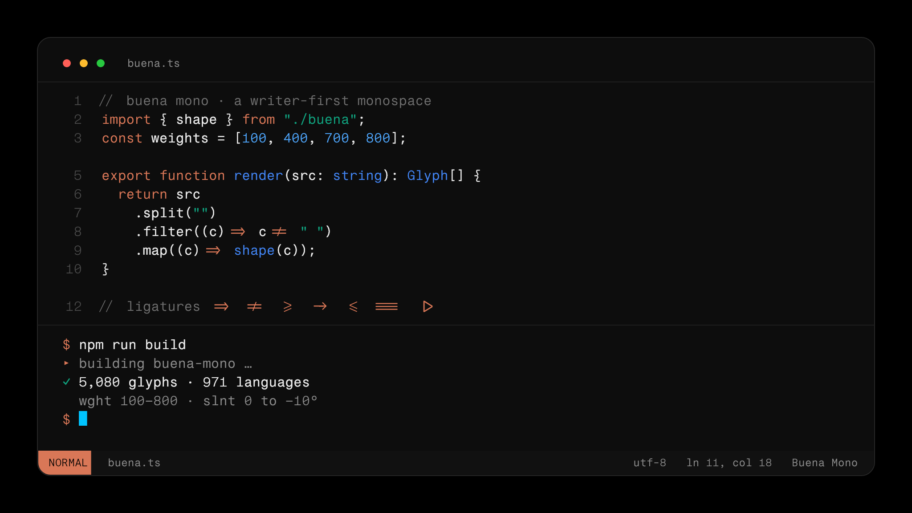
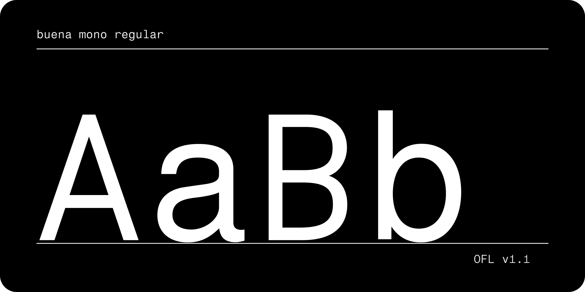
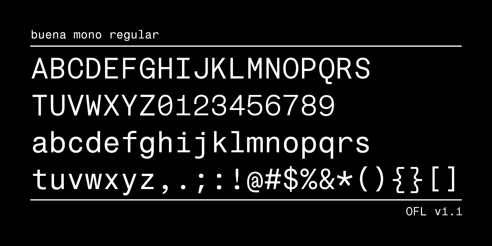
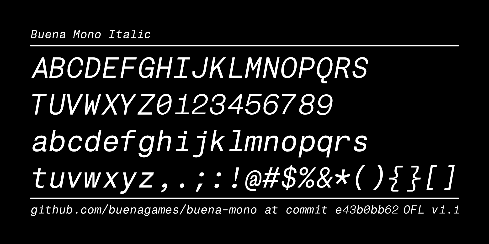

# Buena Mono

<!-- QA badges — uncomment when the repo is public and the DEPLOY_PAGES
     repository variable is set to "true" (Settings > Pages must be on
     "GitHub Actions"). The JSON endpoints are published by CI to Pages.

[![][Fontspector]](https://buenagames.github.io/buena-mono/fontspector/fontspector-report.html)
[![][OpenType]](https://buenagames.github.io/buena-mono/fontspector/fontspector-report.html)
[![][Universal]](https://buenagames.github.io/buena-mono/fontspector/fontspector-report.html)
[![][Google Fonts]](https://buenagames.github.io/buena-mono/fontspector/fontspector-report.html)
[![][Glyphset]](https://buenagames.github.io/buena-mono/fontspector/fontspector-report.html)

[Fontspector]: https://img.shields.io/endpoint?url=https%3A%2F%2Fbuenagames.github.io%2Fbuena-mono%2Fbadges%2FFontspectorQA.json
[OpenType]: https://img.shields.io/endpoint?url=https%3A%2F%2Fbuenagames.github.io%2Fbuena-mono%2Fbadges%2FOpentypeSpecificationChecks.json
[Universal]: https://img.shields.io/endpoint?url=https%3A%2F%2Fbuenagames.github.io%2Fbuena-mono%2Fbadges%2FUniversalProfileChecks.json
[Google Fonts]: https://img.shields.io/endpoint?url=https%3A%2F%2Fbuenagames.github.io%2Fbuena-mono%2Fbadges%2FFontFileChecks.json
[Glyphset]: https://img.shields.io/endpoint?url=https%3A%2F%2Fbuenagames.github.io%2Fbuena-mono%2Fbadges%2FGlyphsetChecks.json
-->

A free, open-source, writer-first monospace programming font — tuned for
extended prose in markdown and code editors while keeping code perfectly
legible. A two-axis variable font: **weight 100–800** and **slant 0 to −10°**,
8 masters, 5,375 glyphs, 971 languages.

**[Specimen & docs →](https://buena-mono.buenalabs.io)** · Coming soon to **Google Fonts**





Released under the [SIL Open Font License 1.1](OFL.txt).

## Install

Grab the fonts from [`fonts/variable/`](fonts/variable) — `BuenaMono-VF.ttf`
(variable TrueType), `.otf` (variable CFF2), `.woff2` (webfont):

- **macOS** — open `BuenaMono-VF.ttf` and click *Install Font* (or drop it into Font Book).
- **Windows** — right-click `BuenaMono-VF.ttf` → *Install*.
- **Linux** — copy to `~/.local/share/fonts/` and run `fc-cache -f`.

**Web** — self-host the variable webfont:

```css
@font-face {
  font-family: "Buena Mono";
  src: url("BuenaMono-VF.woff2") format("woff2");
  font-weight: 100 800;
}
/* slant is on the `slnt` axis (0 to -10): */
.slanted { font-variation-settings: "slnt" -10; }
```

## Features

- **Axes:** weight 100–800, slant 0 to −10°
- **5,375 glyphs / 971 languages:** Latin (incl. Extended A–D), Greek,
  Cyrillic, IPA, math
  operators, arrows, box-drawing, block/shade elements, sextant + octant
  block graphics, currency
- **Terminal-ready** — complete Powerline (`E0A0`–`E0B3`), box-drawing,
  block/shade, the full **Braille Patterns** block (`U+2800`–`28FF`), and the
  Legacy Computing **sextants** (`U+1FB00`–`1FB3B`) and **block octants**
  (`U+1CD00`–`1CDE5`) — uncommon in monospace fonts, and the basis for high-res
  terminal graphics (btop, plots, sparklines) that render cleanly instead of
  font-falling-back
- **Code ligatures** — multi-cell and column-alignment preserving
- **13 stylistic sets** — single-story `a`, tailed `l`, dotted/plain zero, and
  `ss13` machine-readable mode (decomposes every ligature for OCR/verbatim)
- OpenType: `ccmp`, `mark`, `mkmk`, `aalt`, `calt`, `liga`, `smcp`, `ss01`–`ss13`

## Specimen

Weight from hairline thin to solid extrabold, code ligatures, and multi-script
coverage:


## Stylistic sets

Thirteen stylistic sets (`ss01`–`ss13`) provide alternate letterforms:


Enable one with `font-feature-settings: "ss01" 1;` (CSS) or your editor's
OpenType settings.

## Character set





## Enabling ligatures in your editor

Buena Mono's code ligatures use `calt`/`liga`, which are on by default in most
engines. Where they aren't:

- **VS Code** — `"editor.fontFamily": "Buena Mono"`, `"editor.fontLigatures": true`
- **JetBrains IDEs** — Settings → Editor → Font → *Buena Mono*, check *Enable ligatures*
- **Sublime Text** — set `"font_face": "Buena Mono"`; ligatures are on unless `no_calt` is listed in `"font_options"`
- **Neovim/Vim** — use a GUI (Neovide, MacVim) with `guifont=Buena\ Mono`
- **Terminals** — iTerm2: *Use ligatures* in the profile; Kitty: on by default

### Ghostty

Buena Mono is a variable font (`wght` 100–800), so tune weight on the axis
instead of pixel-thickening — it stays crisper:

```ini
# ~/.config/ghostty/config
# NOTE: Ghostty has no inline comments — a "#" after a value becomes part of
# the value. Keep every comment on its own line, as below.

font-family = "Buena Mono"
font-size   = 13

# Buena Mono is variable; nudge Regular 400 → 440 for terminal crispness.
font-variation      = wght=440
# Keep Bold at the true Bold master (800 = ExtraBold).
font-variation-bold = wght=700

# A touch of leading.
adjust-cell-height  = 6%

# Coding ligatures (calt/liga) are on by default. To turn them off, uncomment:
# font-feature = -calt
# font-feature = -liga

# Legibility opt-ins — dotted zero (ss11), slashed zero (zero), serifed i/j (ss04):
# font-feature = ss11
# font-feature = zero
# font-feature = ss04
```

- `font-variation` needs the variable `BuenaMono-VF.ttf`; with the static
  family (Thin–ExtraBold) use `font-thicken = true` instead.
- For native italics, install the Roman + Italic pair, or add
  `font-variation-italic = slnt=-10`.

## Build from source

Requires Python 3.9+.

```sh
make build    # build the variable fonts into out/fonts/
make test     # QA with fontspector
make proof    # HTML proofs with diffenator2
```

Design source: [`sources/BuenaMono.glyphs`](sources/) (Glyphs 3), with UFO
masters and a `.designspace`. See [CONTRIBUTING.md](CONTRIBUTING.md) and the
[CHANGELOG](CHANGELOG.md).

## Bonus — spinner verbs

Buena Mono is a writer-first dev font, so it ships a matching spinner.
[`extras/spinner-verbs.json`](extras/spinner-verbs.json) is a 235-verb set for
your AI coding agent's thinking spinner — merge it into your agent's
configuration, or watch the verbs cycle on the
[specimen](https://buena-mono.buenalabs.io/#spinner).

## Credits

Made by [Buena](https://buenalabs.io).

Specimen images are licensed [CC BY-SA 4.0](docs/images-license.txt).

## License

Buena Mono is licensed under the [SIL Open Font License, Version 1.1](OFL.txt).

Copyright 2026 The Buena Mono Project Authors · [buenalabs.io](https://buenalabs.io)
