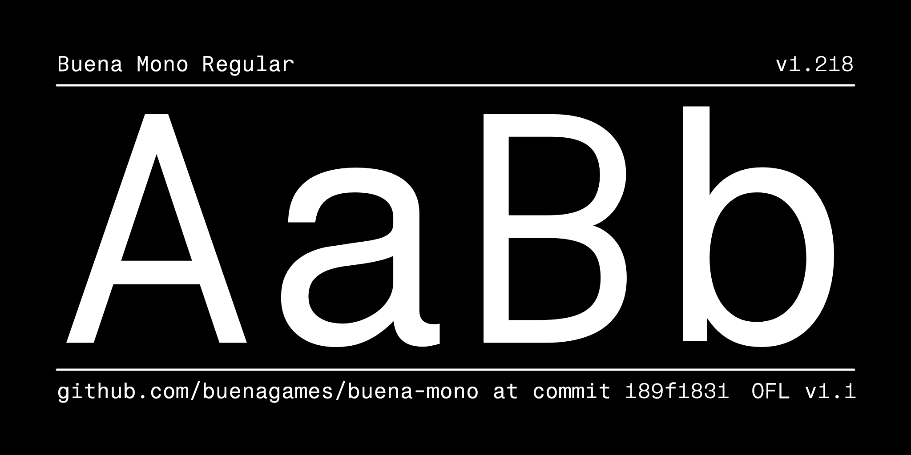
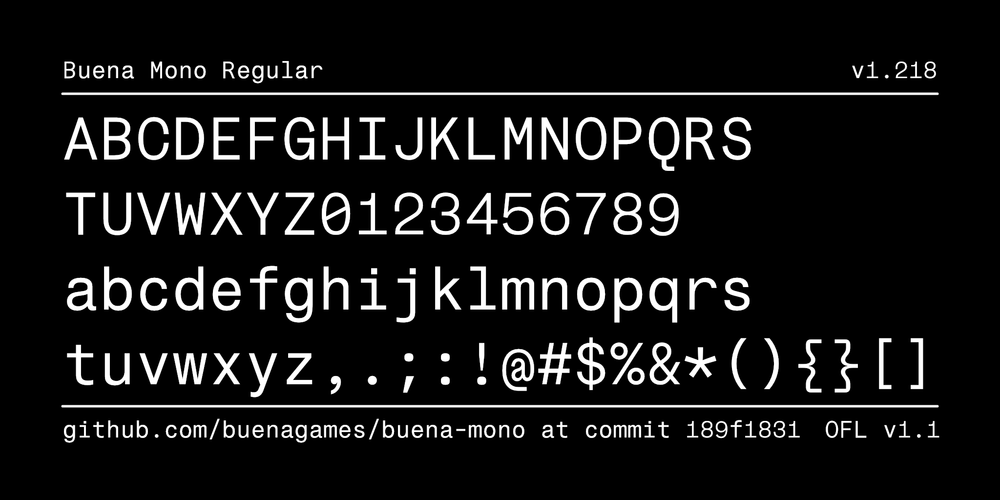

# Buena Mono

Writer-first monospace typeface — tuned for extended prose in markdown and code
editors while keeping code perfectly legible. A two-axis variable font: **weight
100–800** and **slant 0 to −10°**, 8 masters, 4,857 glyphs.



Buena Mono is built on [Fragment Mono](https://github.com/weiweihuanghuang/fragment-mono)
by Wei Huang and extended into a variable family. Released under the
[SIL Open Font License 1.1](OFL.txt).

## Install

Grab the fonts from [`fonts/variable/`](fonts/variable) — `BuenaMono-VF.ttf`
(variable TrueType), `.otf` (variable CFF2), `.woff2` (webfont):

- **macOS** — open `BuenaMono-VF.ttf` and click *Install Font* (or drop it into Font Book).
- **Windows** — right-click `BuenaMono-VF.ttf` → *Install*.
- **Linux** — copy to `~/.local/share/fonts/` and run `fc-cache -f`.

**Web** — self-host the variable webfont:

```css
@font-face {
  font-family: "Buena Mono";
  src: url("BuenaMono-VF.woff2") format("woff2");
  font-weight: 100 800;
}
/* slant is on the `slnt` axis (0 to -10): */
.slanted { font-variation-settings: "slnt" -10; }
```

## Features

- **Axes:** weight 100–800, slant 0 to −10°
- **4,857 glyphs:** Latin (incl. Extended A–D), Greek, Cyrillic, IPA, math
  operators, arrows, box-drawing, block/shade elements, currency
- **Code ligatures** — multi-cell and column-alignment preserving
- **12 stylistic sets** — single-story `a`, tailed `l`, dotted/plain zero, and more
- OpenType: `ccmp`, `mark`, `mkmk`, `aalt`, `calt`, `liga`, `smcp`, `ss01`–`ss12`

## Specimen

Weight from hairline thin to solid extrabold, code ligatures, and multi-script
coverage:


## Stylistic sets

Twelve stylistic sets (`ss01`–`ss12`) provide alternate letterforms:


Enable one with `font-feature-settings: "ss01" 1;` (CSS) or your editor's
OpenType settings.

## Character set




## In use

<table>
<tr><th align="left">Regular</th><th align="left">Regular · dark</th></tr>
<tr>
<td width="50%"></td>
<td width="50%"></td>
</tr>
<tr><th align="left">Regular + Bold</th><th align="left">Regular + Bold · dark</th></tr>
<tr>
<td></td>
<td></td>
</tr>
<tr><th align="left">Regular + Italic</th><th align="left">Regular + Italic · dark</th></tr>
<tr>
<td></td>
<td></td>
</tr>
</table>

## Enabling ligatures in your editor

Buena Mono's code ligatures use `calt`/`liga`, which are on by default in most
engines. Where they aren't:

- **VS Code** — `"editor.fontFamily": "Buena Mono"`, `"editor.fontLigatures": true`
- **JetBrains IDEs** — Settings → Editor → Font → *Buena Mono*, check *Enable ligatures*
- **Sublime Text** — set `"font_face": "Buena Mono"`; ligatures are on unless `no_calt` is listed in `"font_options"`
- **Neovim/Vim** — use a GUI (Neovide, MacVim) with `guifont=Buena\ Mono`
- **Terminals** — iTerm2: *Use ligatures* in the profile; Kitty: on by default

## Build from source

Requires Python 3.9+.

```sh
make build    # build the variable fonts into out/fonts/
make test     # QA with fontspector
make proof    # HTML proofs with diffenator2
```

Design source: [`sources/BuenaMono.glyphs`](sources/) (Glyphs 3), with UFO
masters and a `.designspace`. See [CONTRIBUTING.md](CONTRIBUTING.md) and the
[CHANGELOG](CHANGELOG.md).

## Credits

Made by [Buena](https://buenalabs.io). Built on
[Fragment Mono](https://github.com/weiweihuanghuang/fragment-mono) by Wei Huang
(SIL OFL 1.1), itself based on Nimbus Sans.

Specimen images are licensed [CC BY-SA 4.0](docs/images-license.txt).

## License

Buena Mono is licensed under the [SIL Open Font License, Version 1.1](OFL.txt).
Portions copyright the [Fragment Mono](https://github.com/weiweihuanghuang/fragment-mono)
Project Authors.

Copyright 2026 The Buena Mono Project Authors · [buenalabs.io](https://buenalabs.io)
