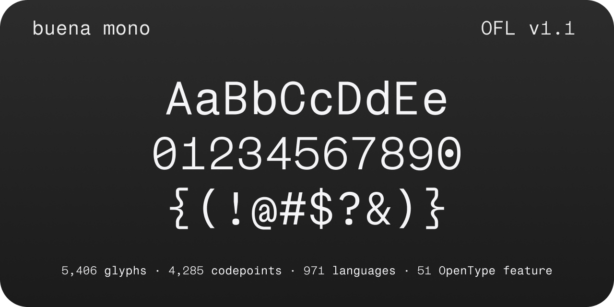
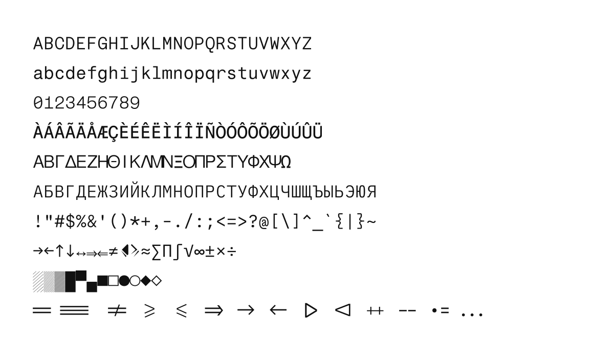
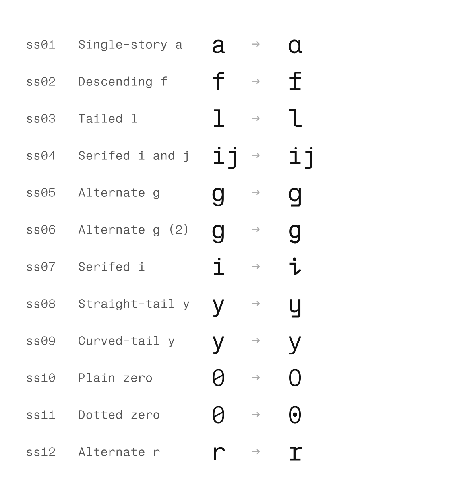
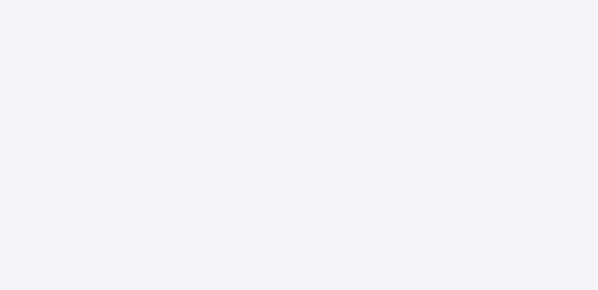
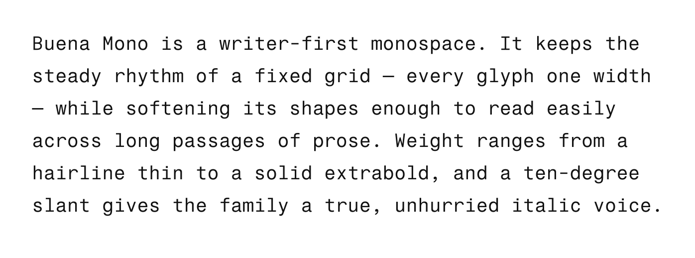
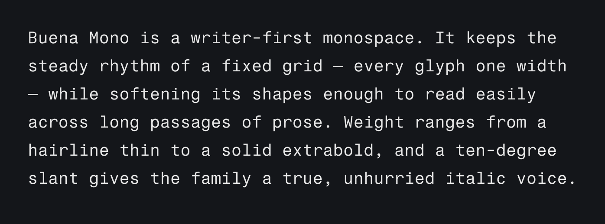
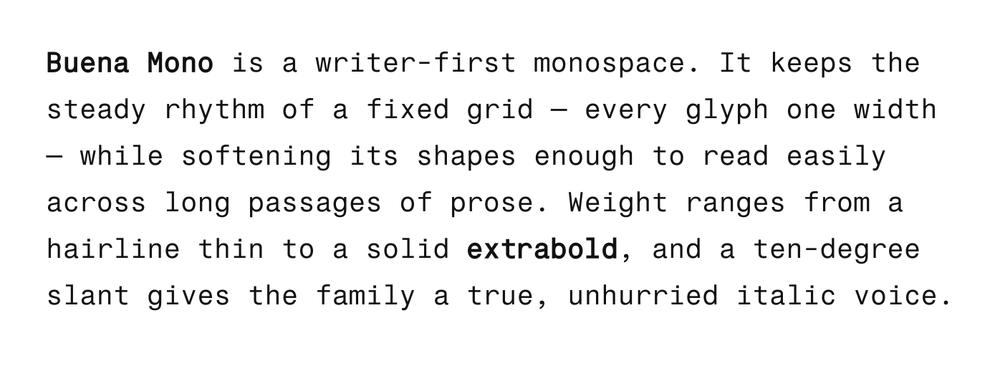
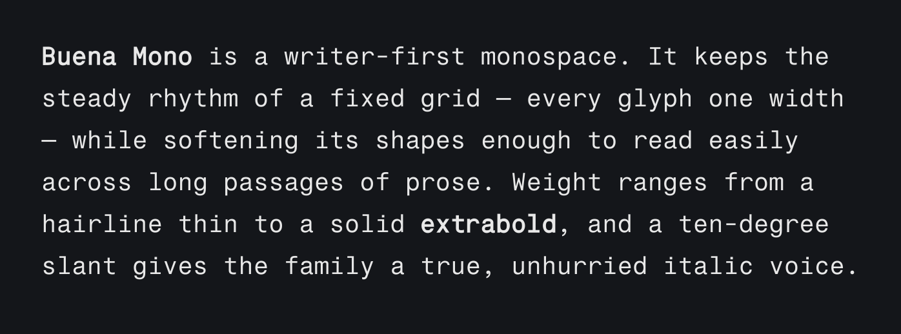
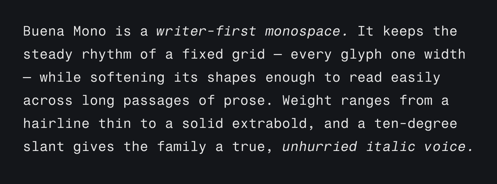

# buena mono

Writer-first monospace typeface — tuned for extended prose in markdown and code
editors while keeping code perfectly legible. A two-axis variable font:
**weight 100–800** and **slant 0 to −10°**, from 8 masters.



**5,406 glyphs · 4,285 codepoints · 971 languages · 51 OpenType features**

### [⬇ Download the latest release](https://github.com/buenagames/buena-mono/releases/latest) · [Try it in the browser →](https://buena-mono.buenalabs.io)

buena mono is a **derivative work, not an original design**. Its core Latin
outlines come from [Fragment Mono](https://github.com/weiweihuanghuang/fragment-mono)
by Wei Huang, itself derived from Nimbus Sans (URW Design Studio), and were
then substantially transformed — see [Provenance](#provenance). Released under
the [SIL Open Font License 1.1](OFL.txt).

## Install

**[Download the latest release](https://github.com/buenagames/buena-mono/releases/latest)**
— a single zip with every format plus the licence. Unzip it and you'll find the
fonts in `fonts/`:

| File | Use |
|---|---|
| `BuenaMono-VF.ttf` | variable TrueType — install this one on your machine |
| `BuenaMono-VF.otf` | variable CFF2 |
| `BuenaMono-VF.woff2` | webfont |
| `BuenaMono[wght].ttf` · `BuenaMono-Italic[wght].ttf` | the Google Fonts pair (see below) |

Then:

- **macOS** — open `BuenaMono-VF.ttf` and click *Install Font* (or drop it into Font Book).
- **Windows** — right-click `BuenaMono-VF.ttf` → *Install*.
- **Linux** — copy to `~/.local/share/fonts/` and run `fc-cache -f`.

To browse the individual files instead of the zip, they're in
[`fonts/variable/`](fonts/variable).

**Web** — self-host the variable webfont:

```css
@font-face {
  font-family: "Buena Mono";
  src: url("BuenaMono-VF.woff2") format("woff2");
  font-weight: 100 800;
}
/* slant is a separate axis (0 to -10): */
.slanted { font-variation-settings: "slnt" -10; }
```

> **Two builds.** `BuenaMono-VF` is the two-axis font above, and is the
> recommended download. The Google Fonts distribution instead ships a Roman +
> Italic pair — `BuenaMono[wght].ttf` and `BuenaMono-Italic[wght].ttf` — with
> `slnt` pinned to 0 and −10, because Google Fonts models italics as a separate
> family member rather than an axis. Both come from the same masters; the pair
> is generated by [`scripts/build-gf-pair.py`](scripts/build-gf-pair.py).

## Design

| | |
|---|---|
| Units per em | 1000 |
| Advance width | 618 (all glyphs, including ligatures, which occupy whole multiples) |
| Cap height | 699 |
| x-height | 524 |
| Ascender / descender | 950 / −250 |
| Masters | 8 (4 weights × upright/slanted) |
| Named instances | 16 — Thin, ExtraLight, Light, Regular, Medium, SemiBold, Bold, ExtraBold, each upright and italic |

The high x-height-to-cap ratio (524/699) is the main concession to prose: it
keeps lowercase text substantial at the small sizes editors run at, without
lengthening the ascenders enough to loosen line spacing.

The italics are **obliques**: a 10° shear of the upright masters, with each
glyph re-centred in the cell. They are not redrawn cursive forms, and no
letter takes a different skeleton when slanted. This is the usual approach for
a monospace, where every form has to stay on the same fixed advance either way.

Every advance width is an exact multiple of 618 — 618 for ordinary glyphs,
1236 / 1854 / 2472 for multi-cell ligatures — so no sequence can fall out of
column alignment.

## Character set



Latin (including Extended A–D), Greek, Cyrillic, IPA, math operators, arrows,
box drawing, block and shade elements, Braille, Legacy Computing block graphics,
Powerline, game and music symbols, and currency.

Language support is verified with [shaperglot](https://github.com/googlefonts/shaperglot)
rather than counted from codepoints, so the 971 figure reflects languages that
actually shape correctly.

## Features

51 OpenType features (49 GSUB, 2 GPOS), including:

- **Ligatures** (`liga`, `calt`) — code ligatures that preserve column
  alignment: each occupies a whole number of cells (see [Design](#design)), so
  `!=` and `=>` never pull a line out of grid.
- **Small caps** (`smcp`, `c2sc`) across the full cased range.
- **Figures** (`lnum`, `tnum`, `onum`, `numr`, `dnom`, `sups`, `sinf`, `frac`).
- **Marks** (`ccmp`, `mark`, `mkmk`) — anchor-driven, generated from the source.
- **13 stylistic sets** (`ss01`–`ss13`) and **13 character variants**
  (`cv01`–`cv13`).

### Stylistic sets

| Tag | Alternate | | Tag | Alternate |
|---|---|---|---|---|
| `ss01` | Single-story `a` | | `ss08` | Straight-tail `y` |
| `ss02` | Descending `f` | | `ss09` | Curved-tail `y` |
| `ss03` | Tailed `l` | | `ss10` | Plain zero |
| `ss04` | Serifed `i` and `j` | | `ss11` | Dotted zero |
| `ss05` | Alternate `g` | | `ss12` | Alternate `r` |
| `ss06` | Alternate `g` (2) | | `ss13` | Machine-readable mode |
| `ss07` | Serifed `i` | | | |



`ss13` is intended for text that will be read back by OCR or a vision model: it
decomposes ligatures and resolves the zero to its unambiguous slashed form,
leaving the default `0` untouched.

Enable a set with `font-feature-settings: "ss01" 1;` in CSS, or through your
editor's OpenType settings.

## In Writing App Editor



## In use

<table>
<tr><th align="left">Regular</th><th align="left">Regular · dark</th></tr>
<tr>
<td width="50%"></td>
<td width="50%"></td>
</tr>
<tr><th align="left">Regular + Bold</th><th align="left">Regular + Bold · dark</th></tr>
<tr>
<td></td>
<td></td>
</tr>
<tr><th align="left">Regular + Italic</th><th align="left">Regular + Italic · dark</th></tr>
<tr>
<td></td>
<td></td>
</tr>
</table>

## Enabling ligatures in your editor

buena mono's code ligatures use `calt`/`liga`, which are on by default in most
engines. Where they aren't:

- **VS Code** — `"editor.fontFamily": "Buena Mono"`, `"editor.fontLigatures": true`
- **JetBrains IDEs** — Settings → Editor → Font → *Buena Mono*, check *Enable ligatures*
- **Sublime Text** — set `"font_face": "Buena Mono"`; ligatures are on unless `no_calt` is listed in `"font_options"`
- **Neovim/Vim** — use a GUI (Neovide, MacVim) with `guifont=Buena\ Mono`
- **Terminals** — iTerm2: *Use ligatures* in the profile; Kitty: on by default

## Build from source

Requires Python 3.9+.

```sh
make build      # build the variable fonts into out/fonts/
make qa         # validation suite (metrics, winding, monospace integrity)
make test       # fontspector QA against the Google Fonts profile
make proof      # HTML proofs with diffenator2
make package    # assemble the Google Fonts submission (Roman + Italic pair)
```

Design source: [`sources/BuenaMono.glyphs`](sources/) (Glyphs 3), with generated
UFO masters and a `.designspace`. Mark and mkmk features are generated from the
source's anchors at build time rather than hand-maintained.

See [CONTRIBUTING.md](CONTRIBUTING.md), the [CHANGELOG](CHANGELOG.md), and
[RELEASES.md](RELEASES.md).

## Feedback

Spotted a glyph that looks wrong, a ligature misbehaving in your editor, or a
language that doesn't shape correctly?
**[Open an issue](https://github.com/buenagames/buena-mono/issues/new/choose)** —
there are short forms for each, and they ask for the details needed to
reproduce it (codepoint, app and OS, sample text).

You don't need to build the font to report something. Design feedback from
writers and designers is as useful as bug reports from developers.

## Credits

Made by [Buena](https://buenalabs.io).

## Provenance

buena mono is a derivative work. Its core Latin outlines were imported from
[Fragment Mono](https://github.com/weiweihuanghuang/fragment-mono) (Wei Huang,
OFL 1.1), which itself derives from Nimbus Sans (URW Design Studio). Those
outlines were then substantially transformed for this project:

- Respaced to a 618-unit cell — Fragment uses a narrower cell matched to
  SF Mono for terminal compatibility.
- Cap height set to 699; Fragment reduces its cap height below standard for
  line-fitting, which costs markdown headings their prominence.
- A weight axis (`wght` 100–800) derived across 8 masters — Fragment ships a
  single weight.
- A slant axis (`slnt` 0 to −10°) added.
- Character set extended well beyond Fragment's Latin coverage, to 5,406
  glyphs.

Additional glyphs and reference outlines are drawn from the OFL families below.
Every one is retained in the copyright notice on line 1 of [OFL.txt](OFL.txt),
as the license requires:

| Family | Contribution |
|---|---|
| [Fragment Mono](https://github.com/weiweihuanghuang/fragment-mono) | core Latin outlines |
| [IBM Plex Mono](https://github.com/IBM/plex) | Cyrillic, Latin Extended A/B, Pinyin |
| [Noto (Latin/Greek/Cyrillic)](https://github.com/notofonts/latin-greek-cyrillic) | polytonic Greek, Cyrillic Extended, Latin Extended-B |
| [Cascadia Code](https://github.com/microsoft/cascadia-code) · [JetBrains Mono](https://github.com/JetBrains/JetBrainsMono) | Greek & Coptic |
| [Bravura](https://github.com/steinbergmedia/bravura) | treble and bass clefs (U+1D11E, U+1D122) |

The Reserved Font Names of the upstream projects are respected: this font is
named **buena mono** and carries no upstream RFN. [`FONTLOG.txt`](FONTLOG.txt)
records the derivation and the full copyright chain.

## License

**buena mono** is licensed under the [SIL Open Font License, Version 1.1](OFL.txt).

Copyright 2026 The buena mono Project Authors · [buenalabs.io](https://buenalabs.io)
